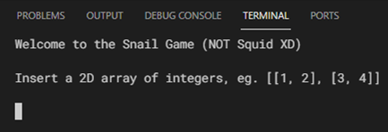
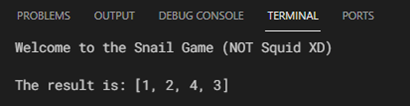

# Logical Challenge #1 

By: [G.A.JAGUAR](https://github.com/gajaguar)


## Description

Given a bidimentional array `n * m`, develop a function that generates an
unidimentional array `1 * nm` which elements correspond with original array's
elements obtained by following a clockwise snail trajectory.

## Example

Input:

```python
[
    [ 1, 2, 3 ],
    [ 4, 5, 6 ],
    [ 7, 8, 9 ],
]
```

Output:

```python
[ 1, 2, 3, 6, 9, 8, 7, 4, 5 ]
```

## Solution

There is a four basic movements that can be performed by _the snail_: right,
down, left and up (in that order, I mean clockwise). Each lap of this curious
animal will reduce the distance by one.

This movements will be repeated until _the snail_ reaches the last element of
original array.

On each step of our dear friend, it will store the current value into a new
array, at the end it will return this last one.

## Algorithm

1. Begin.
2. Read `array`
3. Verify if `array` has two rows at least.
4. Verify if each row has two columns at least.
5. Verify if all rows are of the same size.
6. Verify if all items are integers.
7. Initialize `result` array.
8. Initialize `rows` with the number of rows of `array`.
9. Initialize `columns` with the number of columns of `array`.
10. Calculate `total` = `rows` * `columns`.
11. Initialize `lap` counter at `0`.
12. Repeat next 4 steps until `result` size = `total` then jump to step 17:
13. Move to right and store into `result` the current value on every step.
14. Move to down and store into `result` the current value on every step.
15. Move to left and store into `result` the current value on every step.
16. Move to up and store into `result` the current value on every step.
17. Add `1` to `lap`.
18. Return `result`.
19. End.

## Code

A implementation of this algorithm is available [here](https://github.com/gajaguar/logical-challenge-1/blob/main/app/main.py).

## Build

> In order to it works properly, first copy `.env.example` file as `.env`.

### Docker

#### Fast setup (only linux os)

```bash
# build docker container.
sh scripts/install

# execute the script.
sh scripts/run
```

#### Manual

```bash
# create a docker image
docker-compose build
```

```bash
# build for execution
docker-compose run --rm app
```

### Local

```bash
# on linux os:
python3 app/main.py

# on widows os:
py app\main.py
```

## Screenshots



